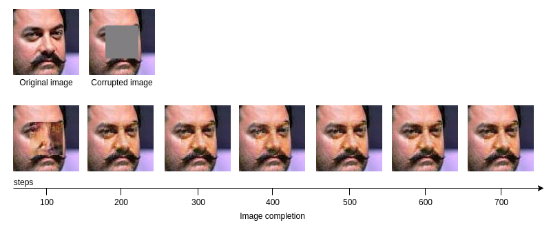
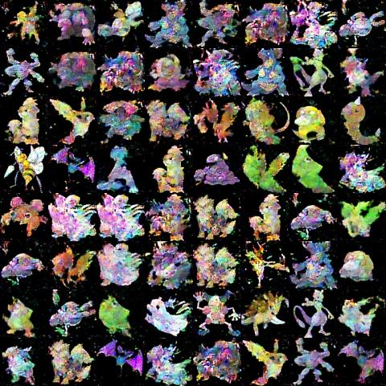

### Image Completion using Deep Convolutional Generative Adversarial Network

[Incomplete]

Adversarial training, first proposed by Ian Goodfellow in his [NIPS-2014 paper](https://arxiv.org/abs/1406.2661), is a way to train two neural networks simultaneously. The first one is the Discriminator, denoted as D(Y), takes an input (e.g. an image) and outputs a scalar indicating whether the image Y looks "natural" or not. The output of D(Y) can be a score turned into a probability using a softmax function. The probability is close to 1 if it's a fake image and close to 0, otherwise. The second network is a Generator, denoted by G(Z), where Z is usually a vector randomly sampled in a simple distribution (e.g. Gaussian). The role of this generator is to generate a fake image so as to train D(Y) to output the correct probability. During training, D is shown a real image and it adjusts its parameters to output the correct probability. Then it is shown an image generated by G. D, again, adjusts its parameters to make its output D(G(Z)), large (following the gradient of a predefined function). But G(Z) will train itself to generate more natural looking images in order to fool D. It does this by taking the gradient of D w.r.t Y for each sample it produces.

I trained the network with a dataset containing images of Indian actors. These are all face images. And these are some of the images generated by the generator after the network has been trained for 100,000 steps on a high performance GPU:


I will be adding some documentation on image completion. Meanwhile, here's some results:



I also tried generating Pokémon images:



*Setup and run:*

```bash
pip3 install --user tensorflow

git clone https://github.com/saikatbsk/ImageCompletion-DCGAN
cd ImageCompletion-DCGAN

# Train
python3 main.py

# Generate
python3 main.py --nois_train --latest_ckpt 100000

# Complete
python3 main.py --is_complete --latest_ckpt 50000 --complete_src /path/to/images
```

*Run on floydhub:*

```bash
pip3 install --user floyd-cli
~/.local/bin/floyd login

git clone https://github.com/saikatbsk/ImageCompletion-DCGAN
cd ImageCompletion-DCGAN

~/.local/bin/floyd init ImageCompletion-DCGAN
~/.local/bin/floyd run --gpu --env tensorflow-1.0 "python main.py --log_dir /output --images_dir /output"
```
