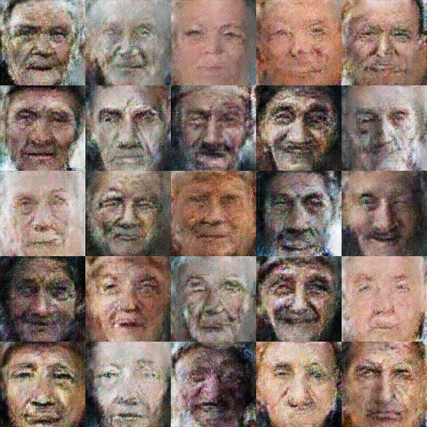

### Deep Convolutional Generative Adversarial Network (DCGAN)

Adversarial training, first proposed by Ian Goodfellow in his [NIPS-2014 paper](https://arxiv.org/abs/1406.2661), is a way to train two neural networks simultaneously. The first one is the Discriminator, denoted as D(Y), takes an input (e.g. an image) and outputs a scalar indicating whether the image Y looks "natural" or not. The output of D(Y) can be a score turned into a probability using a softmax function. The probability is close to 1 if it's a face image and close to 0, otherwise. The second network is a Generator, denoted by G(Z), where Z is usually a vector randomly sampled in a simple distribution (e.g. Gaussian). The role of this generator is to generate a fake image so as to train D(Y) to output the correct probability. During training, D is shown a real image and it adjusts its parameters to output the correct probability. Then it is shown an image generated by G. D, again, adjusts its parameters to make its output D(G(Z)), large (following the gradient of a predefined function). But G(Z) will train itself to generate more natural looking images in order to fool D. It does this by taking the gradient of D w.r.t Y for each sample it produces.

*TODO:*
1. Implement batch training.
2. Accept gray images as input.

*Other GAN implementations:*

- https://github.com/goodfeli/adversarial: Theano GAN implementation released by the authors of the GAN paper.
- https://github.com/Newmu/dcgan_code: Theano DCGAN implementation released by the authors of the DCGAN paper.
- https://github.com/carpedm20/DCGAN-tensorflow: Unofficial TensorFlow DCGAN implementation.
- https://github.com/openai/improved-gan: Code behind OpenAI’s first paper.

#### Output:

The training is incomplete. Here's some results after 2000 steps. (I expect far better output after 10000 steps.)



#### Dataset:

A dataset of face (old) images can be downloaded from this google drive link: https://drive.google.com/open?id=0B_uiWs-gNj4wbmF4em1hQ3BHQWM

#### Requirements:

```
sudo pip3 install numpy scipy tensorflow
```

#### Train:

```
python3 main.py --data_dir <path/to/data/directory>
```

#### Generate: (requires checkpoints)

```
python3 main.py --nois_train --latest_ckpt <checkpoint_index>
```

example,

```
python3 main.py --nois_train --latest_ckpt 2000
```
